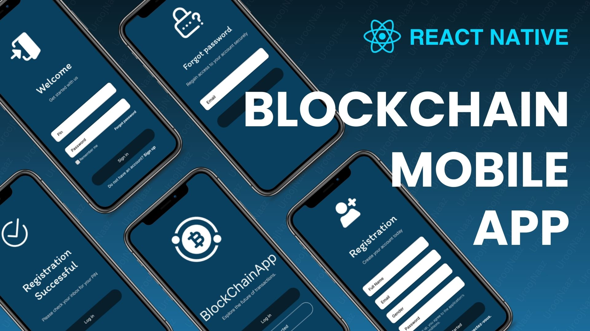
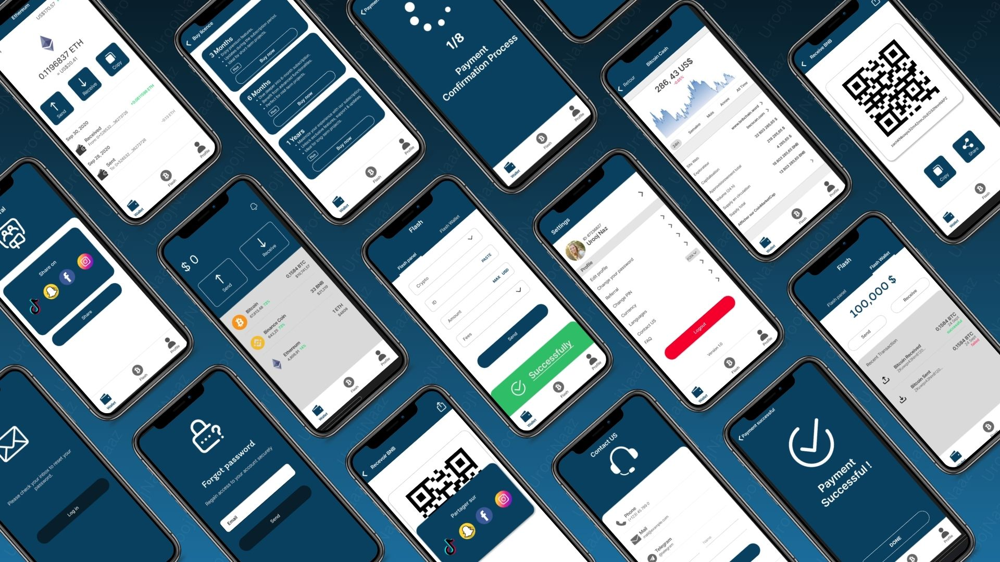

# Blockchain Mobile App in React Native

Explore my feature-rich blockchain mobile app developed using React Native. Seamlessly manage and track your digital assets with an intuitive and user-friendly interface. Dive into the code to see how React Native's cross-platform capabilities bring blockchain technology to your fingertips!

Star⭐ the repo if you like what you see😉.

## 📸 ScreenShots







## ✨ Features
* Cross-Platform: Runs smoothly on both Android and iOS devices.

* User-Friendly Interface: Intuitive design that makes managing digital assets a breeze.

* Real-Time Tracking: Keep tabs on your digital assets with real-time updates.

* Secure Transactions: Built with security best practices to ensure your assets are safe.

* Blockchain Integration: Seamless interaction with blockchain networks to manage transactions and asset tracking.


## Get started

1. Install dependencies

   ```bash
   npm install
   ```

2. Start the app

   ```bash
    npx expo start
   ```

In the output, you'll find options to open the app in a

- [development build](https://docs.expo.dev/develop/development-builds/introduction/)
- [Android emulator](https://docs.expo.dev/workflow/android-studio-emulator/)
- [iOS simulator](https://docs.expo.dev/workflow/ios-simulator/)
- [Expo Go](https://expo.dev/go), a limited sandbox for trying out app development with Expo

You can start developing by editing the files inside the **app** directory. This project uses [file-based routing](https://docs.expo.dev/router/introduction).

## Get a fresh project

When you're ready, run:

```bash
npm run reset-project
```

This command will move the starter code to the **app-example** directory and create a blank **app** directory where you can start developing.

## Learn more

To learn more about developing your project with Expo, look at the following resources:

- [Expo documentation](https://docs.expo.dev/): Learn fundamentals, or go into advanced topics with our [guides](https://docs.expo.dev/guides).
- [Learn Expo tutorial](https://docs.expo.dev/tutorial/introduction/): Follow a step-by-step tutorial where you'll create a project that runs on Android, iOS, and the web.

## Join the community

Join our community of developers creating universal apps.

- [Expo on GitHub](https://github.com/expo/expo): View our open source platform and contribute.
- [Discord community](https://chat.expo.dev): Chat with Expo users and ask questions.


## Happy coding! 🌟

If you have any questions or need further assistance, feel free to reach out.
